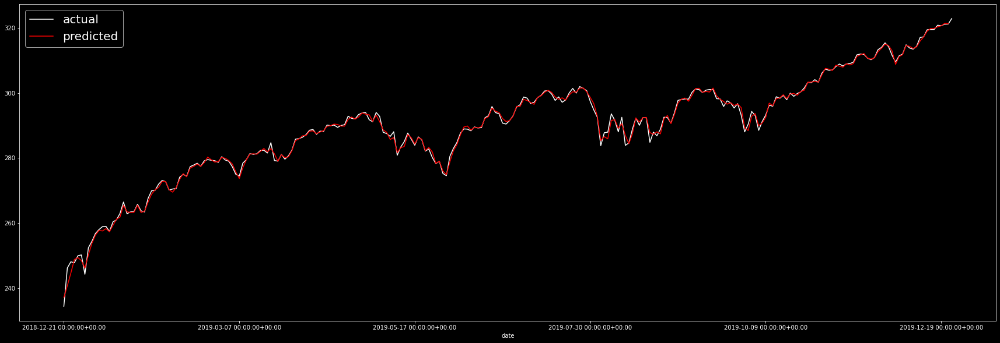

```python
from sklearn.preprocessing import StandardScaler
from sklearn.linear_model import SGDRegressor
from sklearn.pipeline import make_pipeline
```


```python
import pandas as pd

df = pd.read_csv('../data/spy.csv', index_col='date')
```


```python
df['y'] = df.close.shift(-1)
df = df.dropna()
```

    d:\stonks\stonks\lib\site-packages\ipykernel_launcher.py:1: SettingWithCopyWarning: 
    A value is trying to be set on a copy of a slice from a DataFrame.
    Try using .loc[row_indexer,col_indexer] = value instead
    
    See the caveats in the documentation: https://pandas.pydata.org/pandas-docs/stable/user_guide/indexing.html#returning-a-view-versus-a-copy
      """Entry point for launching an IPython kernel.
    


```python
df
```


<div>
<style scoped>
    .dataframe tbody tr th:only-of-type {
        vertical-align: middle;
    }

    .dataframe tbody tr th {
        vertical-align: top;
    }

    .dataframe thead th {
        text-align: right;
    }
</style>
<table border="1" class="dataframe">
  <thead>
    <tr style="text-align: right;">
      <th></th>
      <th>close</th>
      <th>high</th>
      <th>low</th>
      <th>open</th>
      <th>y</th>
    </tr>
    <tr>
      <th>date</th>
      <th></th>
      <th></th>
      <th></th>
      <th></th>
      <th></th>
    </tr>
  </thead>
  <tbody>
    <tr>
      <th>2015-01-02 00:00:00+00:00</th>
      <td>205.43</td>
      <td>206.8800</td>
      <td>204.1800</td>
      <td>206.3800</td>
      <td>201.72</td>
    </tr>
    <tr>
      <th>2015-01-05 00:00:00+00:00</th>
      <td>201.72</td>
      <td>204.3700</td>
      <td>201.3500</td>
      <td>204.1700</td>
      <td>199.82</td>
    </tr>
    <tr>
      <th>2015-01-06 00:00:00+00:00</th>
      <td>199.82</td>
      <td>202.7200</td>
      <td>198.8600</td>
      <td>202.0900</td>
      <td>202.31</td>
    </tr>
    <tr>
      <th>2015-01-07 00:00:00+00:00</th>
      <td>202.31</td>
      <td>202.7200</td>
      <td>200.8800</td>
      <td>201.4200</td>
      <td>205.90</td>
    </tr>
    <tr>
      <th>2015-01-08 00:00:00+00:00</th>
      <td>205.90</td>
      <td>206.1600</td>
      <td>203.9900</td>
      <td>204.0100</td>
      <td>204.25</td>
    </tr>
    <tr>
      <th>...</th>
      <td>...</td>
      <td>...</td>
      <td>...</td>
      <td>...</td>
      <td>...</td>
    </tr>
    <tr>
      <th>2019-12-18 00:00:00+00:00</th>
      <td>319.59</td>
      <td>320.2500</td>
      <td>319.5300</td>
      <td>320.0000</td>
      <td>320.90</td>
    </tr>
    <tr>
      <th>2019-12-19 00:00:00+00:00</th>
      <td>320.90</td>
      <td>320.9800</td>
      <td>319.5246</td>
      <td>319.7999</td>
      <td>320.73</td>
    </tr>
    <tr>
      <th>2019-12-20 00:00:00+00:00</th>
      <td>320.73</td>
      <td>321.9742</td>
      <td>319.3873</td>
      <td>320.4600</td>
      <td>321.22</td>
    </tr>
    <tr>
      <th>2019-12-23 00:00:00+00:00</th>
      <td>321.22</td>
      <td>321.6500</td>
      <td>321.0600</td>
      <td>321.5900</td>
      <td>321.23</td>
    </tr>
    <tr>
      <th>2019-12-24 00:00:00+00:00</th>
      <td>321.23</td>
      <td>321.5200</td>
      <td>320.9000</td>
      <td>321.4700</td>
      <td>322.94</td>
    </tr>
  </tbody>
</table>
<p>1254 rows × 5 columns</p>
</div>


```python
pipe = make_pipeline(StandardScaler(), SGDRegressor(random_state=42))
```


```python
train = df[:1000]
test = df[1000:]
```


```python
pipe.fit(train[['close', 'open', 'high', 'low']], train['y'])
```


    Pipeline(memory=None,
             steps=[('standardscaler',
                     StandardScaler(copy=True, with_mean=True, with_std=True)),
                    ('sgdregressor',
                     SGDRegressor(alpha=0.0001, average=False, early_stopping=False,
                                  epsilon=0.1, eta0=0.01, fit_intercept=True,
                                  l1_ratio=0.15, learning_rate='invscaling',
                                  loss='squared_loss', max_iter=1000,
                                  n_iter_no_change=5, penalty='l2', power_t=0.25,
                                  random_state=42, shuffle=True, tol=0.001,
                                  validation_fraction=0.1, verbose=0,
                                  warm_start=False))],
             verbose=False)


```python
pipe.score(test[['close', 'open', 'high', 'low']], test['y'])
```


    0.9745363780146175


```python
preds = pd.Series(pipe.predict(test[['close', 'open', 'high', 'low']]), name='preds')
```


```python
import matplotlib.pyplot as plt


plt.style.use('dark_background')

```


```python
test['y'].plot(figsize=(30, 10), c='white', label='actual')
preds.shift(-1).plot(c='red', label='predicted')
plt.legend(fontsize=20)
```


    <matplotlib.legend.Legend at 0x1f7e024fa08>





```python
df
```


<div>
<style scoped>
    .dataframe tbody tr th:only-of-type {
        vertical-align: middle;
    }

    .dataframe tbody tr th {
        vertical-align: top;
    }

    .dataframe thead th {
        text-align: right;
    }
</style>
<table border="1" class="dataframe">
  <thead>
    <tr style="text-align: right;">
      <th></th>
      <th>close</th>
      <th>high</th>
      <th>low</th>
      <th>open</th>
      <th>y</th>
    </tr>
    <tr>
      <th>date</th>
      <th></th>
      <th></th>
      <th></th>
      <th></th>
      <th></th>
    </tr>
  </thead>
  <tbody>
    <tr>
      <th>2015-01-02 00:00:00+00:00</th>
      <td>205.43</td>
      <td>206.8800</td>
      <td>204.1800</td>
      <td>206.3800</td>
      <td>201.72</td>
    </tr>
    <tr>
      <th>2015-01-05 00:00:00+00:00</th>
      <td>201.72</td>
      <td>204.3700</td>
      <td>201.3500</td>
      <td>204.1700</td>
      <td>199.82</td>
    </tr>
    <tr>
      <th>2015-01-06 00:00:00+00:00</th>
      <td>199.82</td>
      <td>202.7200</td>
      <td>198.8600</td>
      <td>202.0900</td>
      <td>202.31</td>
    </tr>
    <tr>
      <th>2015-01-07 00:00:00+00:00</th>
      <td>202.31</td>
      <td>202.7200</td>
      <td>200.8800</td>
      <td>201.4200</td>
      <td>205.90</td>
    </tr>
    <tr>
      <th>2015-01-08 00:00:00+00:00</th>
      <td>205.90</td>
      <td>206.1600</td>
      <td>203.9900</td>
      <td>204.0100</td>
      <td>204.25</td>
    </tr>
    <tr>
      <th>...</th>
      <td>...</td>
      <td>...</td>
      <td>...</td>
      <td>...</td>
      <td>...</td>
    </tr>
    <tr>
      <th>2019-12-18 00:00:00+00:00</th>
      <td>319.59</td>
      <td>320.2500</td>
      <td>319.5300</td>
      <td>320.0000</td>
      <td>320.90</td>
    </tr>
    <tr>
      <th>2019-12-19 00:00:00+00:00</th>
      <td>320.90</td>
      <td>320.9800</td>
      <td>319.5246</td>
      <td>319.7999</td>
      <td>320.73</td>
    </tr>
    <tr>
      <th>2019-12-20 00:00:00+00:00</th>
      <td>320.73</td>
      <td>321.9742</td>
      <td>319.3873</td>
      <td>320.4600</td>
      <td>321.22</td>
    </tr>
    <tr>
      <th>2019-12-23 00:00:00+00:00</th>
      <td>321.22</td>
      <td>321.6500</td>
      <td>321.0600</td>
      <td>321.5900</td>
      <td>321.23</td>
    </tr>
    <tr>
      <th>2019-12-24 00:00:00+00:00</th>
      <td>321.23</td>
      <td>321.5200</td>
      <td>320.9000</td>
      <td>321.4700</td>
      <td>322.94</td>
    </tr>
  </tbody>
</table>
<p>1254 rows × 5 columns</p>
</div>


```python

```
